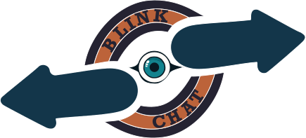

# ISW-project
Project for ISW exam

Made by Vito Paolo Potenza & Giorgio Zappoli

# Relazione di progetto

Lo scopo del progetto è statio quello di progettare e sviluppare una web app di chat a gruppi.

Nello specifio si tratta di un'applicazione in cui occorre creare un account, ogniuno può creare le proprie stanze e parteciapre a stanze già esistenti.
Quando si crea una **stanza** si diventa automaticamente il *proprietario*, avendo così tutti i privilegi quali *rimuovere i messaggi*, *sospendere utenti per un certo periodo di tempo* e *promuovere e rimuovere altri utenti a **moderatore** della camera*.
Ogni **moderatore** può solo eliminare messaggi e sospendere utenti.

## Tecnologie utilizzate

### Frontend

Per il frontend abbiamo utilizzato il framework **Vue.js** in aggiunta a **TypeScript**. Come librerie abbiamo utilizzato **Axios** per le chimate Ajax e **socket.io** per la realizzazione del socket di connessione alle camere testuali. Per migliorare la scritta CSS abbiamo utilizzato **SASS** come estensione per una scrittura più facile e scorrevole.

### Backend

Per il backend invece, abbiamo utilizzato **TypeScript** come linguaggio di scripting, **Express** come framework backend per la gestione delle connessione HTTP e per il routing. **Node.js** è stato utilizzato come motore lato server e **socket.io** per la gestione degli eventi delle chat, quali connessione degli utenti, creazione camere e gestione dei messaggi inviati.
I dati ricevuti lato server vengono poi salvati su un databse **MySQL**, con il quale si effettuano periodicamente chiamate per il corretto funzionamento dell'applicaizone.

***
